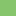
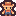
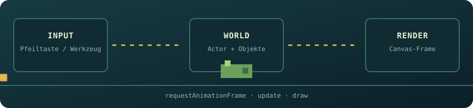
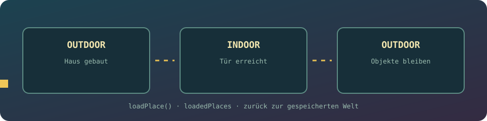
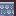
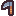
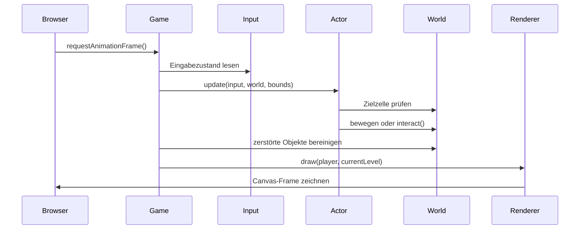
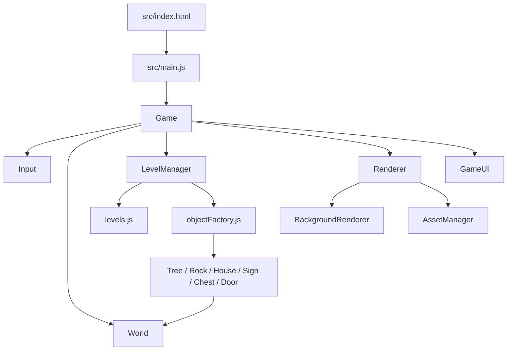
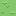
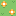

# Tiny Farm Adventure

> Ein kleines Top-down-Pixelspiel mit Ressourcen, Werkzeugen, zerstörbaren Objekten und einem Übergang zwischen Außen- und Innenbereich.

<div align="center">
  
  
  
  
  
</div>

<div align="center">
  <strong>Erkunden · Sammeln · Werkzeuge wechseln · den nächsten Bereich erreichen</strong>
</div>

<br />

<div align="center">
  
</div>

<div align="center">
  
  
</div>

## Inhaltsverzeichnis

- [Über das Projekt](#über-das-projekt)
- [Aktueller Funktionsumfang](#aktueller-funktionsumfang)
- [Spielprinzip](#spielprinzip)
- [Steuerung](#steuerung)
- [Visuelle Vorschau](#visuelle-vorschau)
- [Animationen und Spielabläufe](#animationen-und-spielabläufe)
- [Projektstruktur](#projektstruktur)
- [Architektur](#architektur)
- [Leveldaten](#leveldaten)
- [Starten](#starten)
- [Bekannte Baustellen](#bekannte-baustellen)
- [Nächste sinnvolle Schritte](#nächste-sinnvolle-schritte)
- [Credits und Lizenzen](#credits-und-lizenzen)

## Über das Projekt

Tiny Farm Adventure ist ein Vanilla-JavaScript-Projekt ohne Framework und ohne Build-System. Das Spiel wird direkt im Browser über ein HTML-Canvas gerendert. Die Spielwelt ist in Rasterzellen organisiert: Jede Zelle entspricht einem Tile, einem Objekt oder der Position des Spielers.

Der aktuelle Prototyp konzentriert sich auf den Kern einer kleinen Sammel- und Erkundungsschleife:

1. Der Spieler bewegt sich durch eine 12x12-Außenwelt und ein zweites 20x20-Außenlevel.
2. Bäume und Steine blockieren den Weg.
3. Mit dem passenden Werkzeug können Ressourcen gesammelt werden.
4. Die Ressourcen werden im UI gezählt.
5. Ein Schild zeigt Name und Kosten an, fordert Ressourcen an und kann ein Haus bauen.
6. Das gebaute Haus führt in den Innenbereich; eine Rücktür führt wieder nach draußen.
7. Bereits veränderte Orte bleiben beim Wechsel erhalten: zerstörte Objekte erscheinen nicht erneut.

Die Spielgrafik nutzt Pixel-Art-Tiles aus den mitgelieferten Kenney-Paketen. Dadurch bleibt der Look konsistent, klar lesbar und leicht erweiterbar.

## Aktueller Funktionsumfang

| Bereich           | Status | Beschreibung                                                                                  |
| ----------------- | :----: | --------------------------------------------------------------------------------------------- |
| Canvas-Rendering  |   ✅   | Die Welt wird als Raster auf einem HTML-Canvas gezeichnet.                                    |
| Außenbereiche     |   ✅   | Zwei Außenlevel mit Bäumen, Steinen, Schild und Hausdaten sind definiert.                     |
| Spielerbewegung   |   ✅   | Bewegung über die Pfeiltasten mit Grenzenprüfung.                                             |
| Kollisionsprüfung |   ✅   | Solide Objekte blockieren die Bewegung.                                                       |
| Werkzeugwahl      |   ✅   | Axt, Hacke und Sense werden über Tasten bzw. UI ausgewählt.                                   |
| Baum-Interaktion  |   ✅   | Bäume können mit der Axt gefällt werden und geben Holz.                                       |
| Stein-Interaktion |   ✅   | Steine können mit der Hacke bearbeitet werden und geben Stein.                                |
| Ressourcenanzeige |   ✅   | Holz und Stein werden im UI eingeblendet, sobald sie vorhanden sind.                          |
| Asset-Cache       |   ✅   | Bilder werden über einen zentralen `AssetManager` geladen und wiederverwendet.                |
| Innenbereich      |   ✅   | Indoor-Bereich mit Truhe und Rücktür ist vorhanden.                                           |
| Mehrere Level     |   ✅   | Die Datenstruktur enthält zwei Level; der aktuelle Spielablauf baut im ersten Level ein Haus. |
| Ortszustand       |   ✅   | Geladene Orte werden nicht erneut aufgebaut; zerstörte Objekte bleiben entfernt.              |
| Audio             |   ⏳   | Noch nicht implementiert.                                                                     |
| Gegner            |   ⏳   | Noch nicht implementiert.                                                                     |
| Speichern/Laden   |   ⏳   | Noch nicht implementiert.                                                                     |

## Spielprinzip

### Ressourcen sammeln

Bäume und Steine sind solide GameObjects. Ein passendes Werkzeug wird ausgewählt und anschließend auf das benachbarte Objekt angewendet. Ein Baum verschwindet nach der Interaktion und erhöht den Holzbestand. Ein Stein besitzt mehrere Abbaustufen und verschwindet nach mehreren Treffern.

### Passendes Werkzeug

Jedes Sammelobjekt definiert sein benötigtes Werkzeug:

- `Tree` benötigt `axe` und liefert `wood`.
- `Rock` benötigt `hoe` und liefert `stone`.
- `Sign` prüft die geforderten Ressourcen und baut ein konfiguriertes Objekt.
- `House` dient als Ortsübergang.

Die Werkzeuge werden in den Leveldaten als Assets des Spielers hinterlegt:

```js
assets: [
  { name: "axe", key: "KeyZ" },
  { name: "hoe", key: "KeyX" },
  { name: "sense", key: "KeyC" },
];
```

### Schild, Kosten und Hausbau

Das Schild in der Außenwelt zeigt direkt auf seiner Grafik den Namen des Bauprojekts und die benötigten Ressourcen. Sind beide Mengen vorhanden, werden die Ressourcen abgezogen, ein neues Objekt über die Factory erzeugt und das Schild entfernt. Im aktuellen Level wird auf diese Weise ein Haus gebaut.

<div align="center">
  
  
  
</div>

```js
{
  name: "Haus bauen",
  type: "sign",
  requested: { wood: 9, stone: 9 },
  build: {
    type: "house",
    x: 8,
    y: 4,
    cols: 3,
    rows: 3,
    solid: true,
    tiles: [
      ["...", "...", "..."],
      ["...", "...", "..."],
      ["...", "...", "..."],
    ],
  },
}
```

### Ortswechsel und Rückweg

Das Haus reagiert an seiner Tür auf den Bewegungsversuch des Spielers. Der `LevelManager` lädt den Indoor-Ort und setzt den Spieler auf die Startposition. Die Indoor-Tür ist ein eigenes `Door`-Objekt. Sie lädt beim Betreten wieder `outdoor` und setzt den Spieler unterhalb des Hauses ab.

```text
Haus-Tür:  outdoor → indoor, Spielerposition (2, 2)
Rücktür:  indoor  → outdoor, Spielerposition (9, 7)
```

`loadedPlaces` verhindert, dass ein bereits besuchter Ort erneut aus den Leveldaten erzeugt wird. Dadurch bleiben gefällte Bäume, abgebaute Steine und dynamisch gebaute Häuser erhalten.

## Steuerung

| Eingabe                    | Aktion                                           |
| -------------------------- | ------------------------------------------------ |
| `ArrowUp`                  | Nach oben bewegen                                |
| `ArrowDown`                | Nach unten bewegen                               |
| `ArrowLeft`                | Nach links bewegen                               |
| `ArrowRight`               | Nach rechts bewegen                              |
| `ShiftLeft` / `ShiftRight` | In Bewegungsrichtung angreifen bzw. interagieren |
| `Z`                        | Axt auswählen                                    |
| `X`                        | Hacke auswählen                                  |
| `C`                        | Sense auswählen                                  |
| Mausklick auf Werkzeug     | Werkzeug direkt über das UI auswählen            |

Die Bewegung ist absichtlich rasterbasiert und wird über eine Aktionssperre gedrosselt. Dadurch bewegt sich der Spieler nicht in jedem einzelnen Frame mehrere Zellen weiter, wenn eine Taste gehalten wird.

## Visuelle Vorschau

### Landschaft und Objekte

<table>
  <tr>
    <td align="center"><br /><sub>Gras</sub></td>
    <td align="center"><br /><sub>Baum</sub></td>
    <td align="center"><br /><sub>Stein</sub></td>
    <td align="center"><br /><sub>Haus</sub></td>
    <td align="center"><br /><sub>Spieler</sub></td>
  </tr>
</table>

### Werkzeugleiste

<div align="center">
  
  
  
</div>

Die UI zeigt die Werkzeuge als klickbare Bilder. Das ausgewählte Werkzeug erhält eine grüne Hervorhebung. Ressourcencontainer werden erst eingeblendet, wenn der jeweilige Bestand größer als null ist.

### Innenraum-Tiles

<div align="center">
  
  
</div>

## Animationen und Spielabläufe

Das Projekt verwendet aktuell keine externen Animationsbibliotheken. Die Bewegung entsteht durch die schnelle Wiederholung des Game-Loops mit `requestAnimationFrame`. Objektveränderungen werden als diskrete Zustände behandelt: Ein Objekt ist vorhanden, wird beschädigt oder wird zerstört.

### Bewegungssequenz

```text
┌────────────┐   Pfeiltaste   ┌─────────────┐   gültiges Feld   ┌────────────┐
│ Eingabe    │ ─────────────▶ │ Actor       │ ───────────────▶ │ neue       │
│ keydown    │                │ update()    │                  │ Position   │
└────────────┘                └─────────────┘                  └────────────┘
                                      │
                                      ├── solides Objekt: Interaktion prüfen
                                      └── freies Feld: bewegen und interagieren
```

### Ressourcen-Animation als Zustandsfolge

<table>
  <tr>
    <td align="center"><br /><sub>Stufe 0</sub></td>
    <td align="center">→</td>
    <td align="center"><br /><sub>Stufe 1</sub></td>
    <td align="center">→</td>
    <td align="center"><br /><sub>entfernt</sub></td>
  </tr>
</table>

Der Stein nutzt dafür `stage` als einfachen Animationszustand:

```text
stage = 0  ── Hacke ──▶  stage = 1  ── Hacke ──▶  destroyed = true
```

### Game-Loop



### Animierte README-Szenen

Die README enthält drei kleine SVG-Animationen, die direkt aus dem Projekt verlinkt werden:

- `game-loop.svg` zeigt `requestAnimationFrame`, Update und Rendern.
- `resource-cycle.svg` zeigt Werkzeug, Zielobjekt, Interaktion und Ressourcenbestand.
- `place-transition.svg` zeigt den Weg `outdoor → indoor → outdoor` und den persistenten Ortszustand.

Die Animationen sind bewusst leichtgewichtig: Sie verwenden SVG-`animate`-Elemente und benötigen keine zusätzliche Bibliothek.

## Projektstruktur

```text
1_Spiel/
├── assets/
│   ├── fonts/                  # Pixelify Sans und Press Start 2P
│   └── img/                    # Spiel-, UI-, Haus- und Hintergrundgrafiken
├── old/                        # ältere Prototyp-Dateien
├── src/
│   ├── index.html              # HTML-Einstiegspunkt und UI-Grundstruktur
│   ├── main.js                 # erzeugt die Game-Instanz und startet sie
│   ├── core/
│   │   ├── assets.js           # Bild-Cache und Ladezustände
│   │   ├── game.js             # Game-Loop und zentrale Verkabelung
│   │   ├── input.js            # Tastaturzustand und Bewegung
│   │   └── world.js             # Orte und GameObject-Listen
│   ├── data/
│   │   └── levels.js           # Level, Hintergrund und Objektpositionen
│   ├── entities/
│   │   ├── Actor.js            # Spieler und Aktionen
│   │   ├── Chest.js            # Truhe und Inventar
│   │   ├── Door.js             # Rückweg vom Innen- zum Außenbereich
│   │   ├── GameObject.js       # gemeinsame Objektbasis
│   │   ├── House.js            # Haus und Ortswechsel
│   │   ├── MultiImgObject.js   # Objekte aus mehreren Tiles
│   │   ├── Rock.js             # Stein und Abbaustufen
│   │   ├── Sign.js             # Ressourcenprüfung und Levelziel
│   │   └── Tree.js             # Holzquelle
│   ├── rendering/
│   │   ├── backgroundRenderer.js
│   │   └── renderer.js
│   ├── systems/
│   │   ├── cleanup.js
│   │   ├── interaction.js      # vorgesehene Interaktionsabstraktion
│   │   ├── levelManager.js
│   │   └── objectFactory.js
│   └── ui/
│       └── gameUI.js            # Werkzeuge und Ressourcenanzeige
├── assets/readme/
│   ├── game-loop.svg            # animierter Game-Loop
│   ├── resource-cycle.svg       # animierter Ressourcenzyklus
│   └── place-transition.svg     # animierter Ortswechsel
└── README.md
```

## Architektur

Die Architektur trennt die Verantwortlichkeiten in kleine Module:

- **`Game`** orchestriert Start, Update und Rendern.
- **`World`** verwaltet die aktiven Objekte getrennt nach `outdoor` und `indoor`.
- **`LevelManager`** liest Leveldaten und erstellt die passenden Objekte.
- **`GameObject`** definiert Position, Größe, Bild, Kollision und Zerstörung.
- **`Actor`** verarbeitet Bewegung, Werkzeugwahl und Interaktionen.
- **`Renderer`** kennt die Canvas-Größe und zeichnet Hintergrund, Objekte und Spieler.
- **`AssetManager`** verhindert, dass dasselbe Bild mehrfach geladen wird.
- **`GameUI`** synchronisiert Ressourcen und Werkzeugauswahl mit dem Spieler.



## Leveldaten

Leveldaten sind als JavaScript-Objekt organisiert. Ein Level kann mehrere Orte besitzen, zum Beispiel `outdoor` und `indoor`:

```js
{
  outdoor: {
    rows: 12,
    cols: 12,
    assets: [
      { name: "axe", key: "KeyZ" },
      { name: "hoe", key: "KeyX" },
      { name: "sense", key: "KeyC" },
    ],
    gameObjects: [],
    background: [],
  },
  indoor: {
    rows: 5,
    cols: 5,
    assets: [],
    gameObjects: [],
    background: [],
  },
}
```

Ein Objekt benötigt mindestens einen `type`, eine Position und je nach Objektklasse ein Bild oder ein Tile-Array:

```js
{
  type: "rock",
  src: "../assets/img/kenney_tiny-farm/Tiles/tile_0089.png",
  x: 0,
  y: 7,
  solid: true,
}
```

Für ein mehrteiliges Objekt werden mehrere Bildpfade als Zeilen und Spalten beschrieben:

```js
{
  type: "house",
  x: 8,
  y: 4,
  cols: 3,
  rows: 3,
  solid: true,
  tiles: [
    ["../assets/img/house/tile_0048.png", "../assets/img/house/tile_0049.png", "../assets/img/house/tile_0050.png"],
    ["../assets/img/house/tile_0060.png", "../assets/img/house/tile_0061.png", "../assets/img/house/tile_0062.png"],
    ["../assets/img/house/tile_0072.png", "../assets/img/house/tile_0074.png", "../assets/img/house/tile_0075.png"],
  ],
}
```

## Starten

Da das Spiel ES-Module verwendet, sollte es über einen lokalen HTTP-Server geöffnet werden. Ein direktes Öffnen per `file://` kann wegen Browser-Sicherheitsregeln bei Modul- und Asset-Pfaden scheitern.

### Option A: VS Code Live Server

1. Repository in VS Code öffnen.
2. Eine Erweiterung wie **Live Server** installieren.
3. `src/index.html` öffnen.
4. **Open with Live Server** wählen.

### Option B: Python

Im Projektordner ausführen:

```bash
python -m http.server 8000
```

Danach im Browser öffnen:

```text
http://localhost:8000/src/
```

### Option C: Node.js

Mit einem installierten statischen Server:

```bash
npx serve .
```

Der Einstiegspunkt bleibt:

```text
src/index.html
```

## Bekannte Baustellen

Die folgende Liste beschreibt den aktuellen Entwicklungsstand und ist absichtlich Teil der Dokumentation:

- Die Interaktionslogik läuft derzeit direkt über `Actor` und die Entity-Klassen; eine zentrale Interaktionsabstraktion sollte als nächster Schritt ergänzt oder konsequent verwendet werden.
- Die Interaktionssperre hängt vom korrekten Zurücksetzen der Tastaturereignisse ab. Fokusverlust und gehaltene Tasten sollten noch mit echten Browser-Tests geprüft werden.
- Das Schild baut das Haus dynamisch; eine sichtbare Erfolgsmeldung nach dem Bau fehlt noch.
- Die Außenpositionen der Türen sind derzeit feste Koordinaten in `House.js` und `Door.js` und könnten in die Leveldaten verschoben werden.
- Das Canvas ist derzeit fest auf 480x480 Pixel gesetzt. Eine responsive Skalierung und eine pixelgenaue Darstellung auf mobilen Geräten wären sinnvoll.
- Es gibt noch keine Ladeanzeige für Bilder. Während Assets geladen werden, können einzelne Tiles kurzfristig fehlen.
- Es gibt noch keine automatisierten Tests für Bewegung, Kollisionsprüfung, Ressourcensammlung oder Ortswechsel.

## Nächste sinnvolle Schritte

### 1. Interaktionen zentralisieren

Eine zentrale Funktion sollte Actor und LevelManager an alle Interaktionen übergeben:

```js
export function interact(actor, object, levelManager) {
  object?.interact?.(actor, levelManager);
}
```

Damit sind `Tree`, `Rock`, `Sign`, `House` und `Chest` über denselben Pfad erreichbar.

### 2. Türpositionen in Leveldaten verschieben

Die Eingangs- und Ausgangspositionen sollten pro Level in `levels.js` definiert werden. Dadurch können mehrere Häuser und unterschiedliche Innenräume dieselbe Türlogik verwenden.

### 3. Erfolgsszene ergänzen

Das Schild baut aktuell ein Haus. Der nächste Schritt ist eine sichtbare Rückmeldung nach dem Bezahlen und Bauen:

```text
Ressourcen gesammelt → Schild erfüllt → Haus bauen → Erfolg anzeigen
```

### 4. Browser-Tests hinzufügen

Besonders wertvoll wären Tests für:

- eine Bewegung pro Tastendruck;
- Blockieren an einem soliden Feld;
- Axt + Baum = Holz;
- Hacke + Stein = Stein;
- falsches Werkzeug = keine Änderung;
- Schild mit zu wenig Ressourcen = keine Änderung;
- Haus-Tür = Wechsel in den Innenbereich.

## Credits und Lizenzen

Die verwendeten Pixel-Art-Ressourcen stammen aus den mitgelieferten Kenney-Paketen unter `assets/img/` und den zugehörigen Lizenzdateien:

- `assets/img/kenney_tiny-farm/License.txt`
- `assets/img/kenney_tiny-town/License.txt`
- `assets/img/kenney_ui-pack-pixel-adventure/License.txt`
- `assets/fonts/Pixelify_Sans/OFL.txt`
- `assets/fonts/Press_Start_2P/OFL.txt`

Bitte die jeweiligen Lizenzdateien beachten, wenn das Projekt oder einzelne Assets veröffentlicht oder weitergegeben werden.

---

<div align="center">
  
  
  
  
  
  
  <br />
  <sub>Ein kleiner Pixel-Schritt nach dem anderen.</sub>
</div>
