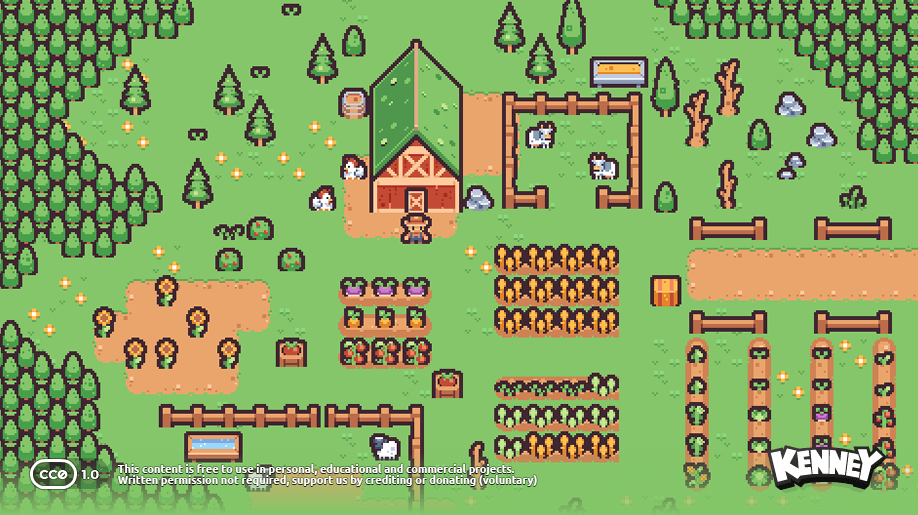
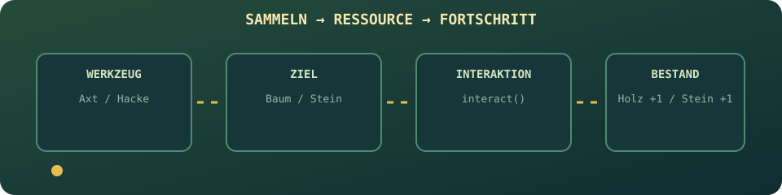

# Harvest Hollow

Ein kleines Top-down-Pixelspiel im Browser. Erkunde deine Farm, sammle Ressourcen,
wechsle zwischen Werkzeugen und baue dir den Weg in den naechsten Bereich frei.

<p align="center">
  
</p>

<p align="center">
  <strong>Pflanzen. Sammeln. Bauen. Entdecken.</strong><br>
  Ein entspanntes Pixel-Abenteuer mit Express, Canvas und Vanilla JavaScript.
</p>

## Spiel-Loop

Die wichtigsten Systeme laufen in einem einfachen, nachvollziehbaren Kreislauf:

<p align="center">
  
</p>

<p align="center"><em>Die Diagramme sind animierte SVGs. Falls dein README-Viewer keine SVG-Animationen abspielt, bleiben sie als Diagramme sichtbar.</em></p>

## Aktueller Stand

Das Spiel ist ein Vanilla-JavaScript-Prototyp ohne Frontend-Framework und ohne
Build-Schritt. Ein Express-Server liefert die Anwendung und die Assets aus.

Aktuell enthalten sind:

- rasterbasierte Bewegung mit den Pfeiltasten;
- Kollisionen mit soliden Objekten;
- Axt, Hacke und Sense als auswaehlbare Werkzeuge;
- Baeume als Holzquelle und Steine mit mehreren Abbaustufen;
- Ressourcenanzeige fuer Holz und Stein;
- ein Schild, das Ressourcen prueft und ein Haus bauen kann;
- ein Wechsel zwischen Aussenbereich und Innenbereich;
- eine Truhe und eine Ruecktuer im Innenbereich;
- persistente Ortszustaende: gesammelte Ressourcen und gebaute Objekte bleiben
  beim Ortswechsel erhalten.
- Registrierung und Login mit gehashten Passwoertern;
- SQLite-Speicherung des erreichten Levels pro Benutzer;
- automatisches Laden des gespeicherten Levels beim Spielstart.

Noch nicht enthalten sind unter anderem Gegner, Audio und automatisierte Tests.

## Ressourcen sammeln

Werkzeuge und Objekte bilden den Kern des Fortschritts:

<p align="center">
  
</p>

## Steuerung

| Eingabe | Aktion |
| --- | --- |
| `ArrowUp`, `ArrowDown`, `ArrowLeft`, `ArrowRight` | Bewegen |
| `ShiftLeft` oder `ShiftRight` | In Bewegungsrichtung interagieren/angreifen |
| `Z` | Axt auswaehlen |
| `X` | Hacke auswaehlen |
| `C` | Sense auswaehlen |
| Mausklick auf ein Werkzeug | Werkzeug ueber die UI auswaehlen |

## Orte wechseln

Nach dem Bau des Hauses kannst du zwischen Aussen- und Innenbereich wechseln.
Der Ortszustand bleibt dabei erhalten:

<p align="center">
  
</p>

## Voraussetzungen

- Node.js
- npm
- SQLite wird automatisch ueber `better-sqlite3` verwendet.

## Installation und Start

Im Projektordner ausfuehren:

```bash
npm install
npm start
```

Anschliessend im Browser oeffnen:

```text
http://localhost:3000
```

Der Startbefehl fuehrt `server.js` aus. Express rendert die EJS-Seiten und
stellt den Ordner `public/` als statische Webanwendung bereit. Fuer den
Spielstand werden `express-session`, SQLite und die Tabelle
`player_progress` verwendet.

Beim ersten Start kannst du unter `/register` ein Konto erstellen und dich
anschliessend unter `/login` anmelden.

## Projektstruktur

```text
.
├── public/
│   ├── assets/
│   │   ├── fonts/             # Pixelify Sans und Press Start 2P
│   │   └── img/               # Spiel-, UI-, Haus- und Hintergrundgrafiken
│   └── src/
│       ├── main.js            # Einstiegspunkt der Spielanwendung
│       ├── core/              # Game-Loop, Eingabe, Welt und Assets
│       ├── data/              # Leveldefinitionen
│       ├── entities/          # Spieler, Haus, Baum, Stein und weitere Objekte
│       ├── rendering/         # Canvas- und Hintergrund-Rendering
│       ├── systems/           # Levelverwaltung, Factory und Aufraeumen
│       └── ui/                # Werkzeug- und Ressourcenanzeige
├── views/
│   ├── index.ejs              # Startseite
│   ├── login.ejs              # Login
│   ├── register.ejs           # Registrierung
│   └── game/index.ejs         # Canvas- und Spieloberflaeche
├── server.js                  # Express-Server auf Port 3000
├── farmer-game.db             # Lokale SQLite-Datenbank (wird erzeugt)
├── package.json               # Abhaengigkeiten und npm-Skripte
└── README.md
```

## Architektur

- `Game` steuert Game-Loop, Update und Rendering.
- `World` verwaltet die aktiven Orte und Objekte.
- `LevelManager` liest die Leveldaten und erstellt die passenden Entities.
- `Actor` verarbeitet Bewegung, Werkzeugwahl und Interaktionen.
- `Renderer` zeichnet Hintergrund, Objekte und Spieler auf das Canvas.
- `AssetManager` laedt und cached die Bilder.
- `GameUI` aktualisiert Werkzeugauswahl und Ressourcenanzeige.
- `server.js` stellt Login, Registrierung und die Progress-API bereit.
- `LevelManager` laedt den gespeicherten Level und meldet Levelwechsel an den
  Express-Server.

Die Leveldaten liegen in `public/src/data/levels.js`. Neue Objekte werden ueber
die Objekt-Factory erzeugt und koennen dadurch als eigene Entity-Klasse
implementiert werden.

### Level-Fortschritt

Der Browser greift nicht direkt auf SQLite zu. Stattdessen sendet der
`LevelManager` Requests an den Server:

```text
GET  /api/progress
POST /api/progress/level
```

Der Server ordnet den Fortschritt dem eingeloggten Benutzer zu. So kann jeder
Spieler seinen eigenen erreichten Level laden.

## Entwicklung

Es gibt derzeit keinen automatisierten Testlauf. Der in `package.json`
definierte Testbefehl ist deshalb noch ein Platzhalter:

```bash
npm test
```

Fuer Aenderungen am Spiel genuegt normalerweise ein Neustart des Servers. Die
Anwendung kann danach unter `http://localhost:3000` neu geladen werden.

Den gespeicherten Level kannst du direkt ansehen:

```bash
sqlite3 farmer-game.db
```

```sql
SELECT * FROM player_progress;
```

## Assets und Lizenzen

Die Pixel-Art-Assets stammen aus den mitgelieferten Kenney-Paketen. Die
zugehoerigen Lizenzdateien liegen direkt in den jeweiligen Asset-Ordnern:

- `public/assets/img/kenney_tiny-farm/License.txt`
- `public/assets/img/kenney_tiny-town/License.txt`
- `public/assets/img/kenney_ui-pack-pixel-adventure/License.txt`
- `public/assets/fonts/Pixelify_Sans/OFL.txt`
- `public/assets/fonts/Press_Start_2P/OFL.txt`

Bitte die jeweiligen Lizenzbedingungen beachten, wenn das Projekt oder einzelne
Assets veroeffentlicht oder weitergegeben werden.
